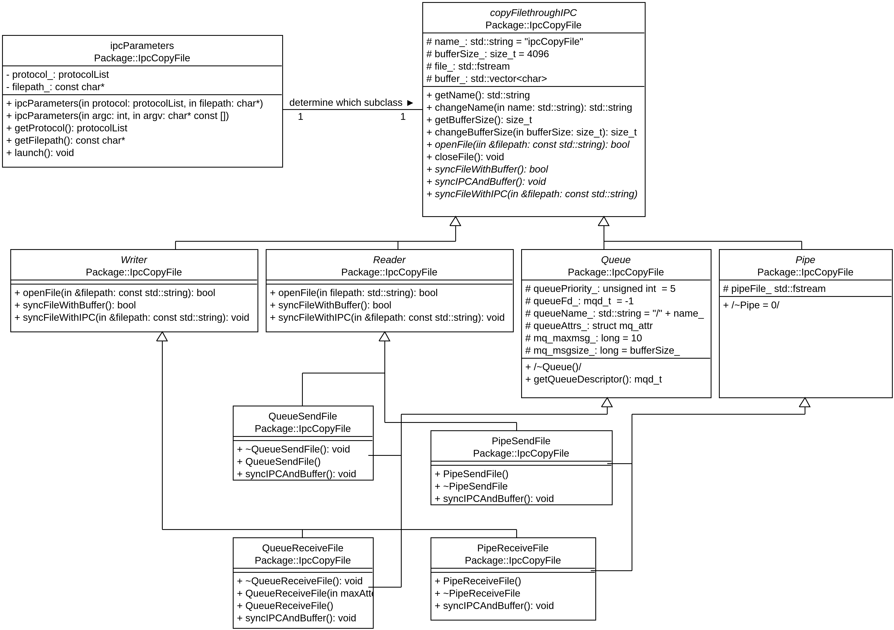
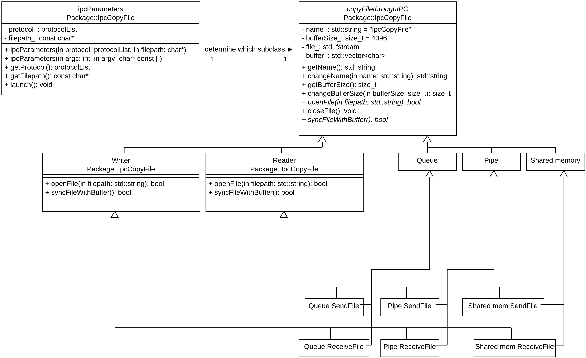

# Table of content
- [Table of content](#table-of-content)
- [Introduction](#introduction)
- [Setup environment, build and test](#setup-environment-build-and-test)
- [How to use the program](#how-to-use-the-program)
- [Design](#design)
  - [Current Design](#current-design)
  - [Future development](#future-development)
- [File structure](#file-structure)
  - [Program sources](#program-sources)
  - [Test sources](#test-sources)
- [Test explanations](#test-explanations)

# Introduction

This programs have the aim to take a file, and copy it. To do it, the program ipc_sendfile read the file and send the data of the file to the program ipc_receivefile which will write the data to a new file. The exchange is doing by IPC.

The IPC methods implemented are:
- [x] Queue message passing
- [ ] Pipe
- [ ] Shared memory 

# Setup environment, build and test

To setup your environment, you shall execute `setup_environment.sh`:
```bash
$ ./setup_environment.sh
```

This script will check if Bazel and g++ are already installed and install them if not.

To build the program and get the test report, you can execute the `build_and_run_tests.sh` file:

```bash
$ ./build_and_run_tests.sh
```

The binary and the test report will be in the folder `output`.

# How to use the program
You can use the program with the argument `--help` .

# Design
## Current Design



## Future development


# File structure

The program sources are in `/src` folder. The test sources are in the `/gtest` folder.

## Program sources
There are 2 main.cpp files : `src/ipc_receivefile/main.cpp` and `src/ipc_sendfile/main.cpp`.

Thoses files use the library write in the `/lib` folder.

## Test sources
`Gtest_manageOpt.cpp` is a file which provides tests for the class IpcParameters.
`Gtest_IpcCopyFile.cpp` is a file which provides tests for the class copyFilethroughIPC.

# Test explanations

Some information can be found on the [Test explanation](/C++_hands_on_programming_RC/Documentation/Tests/TestsExplanation.md)

